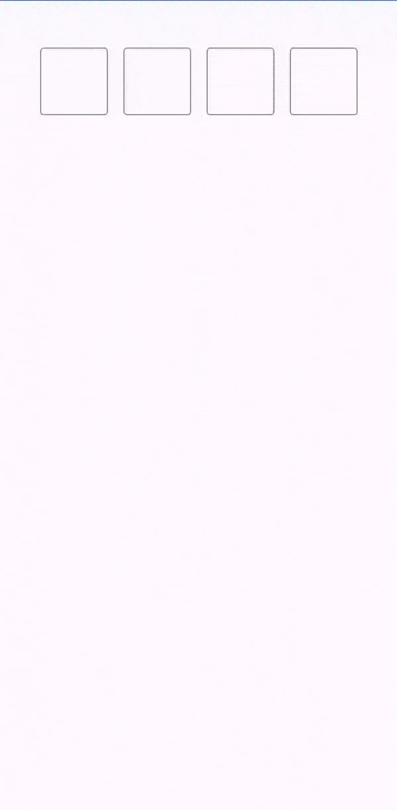
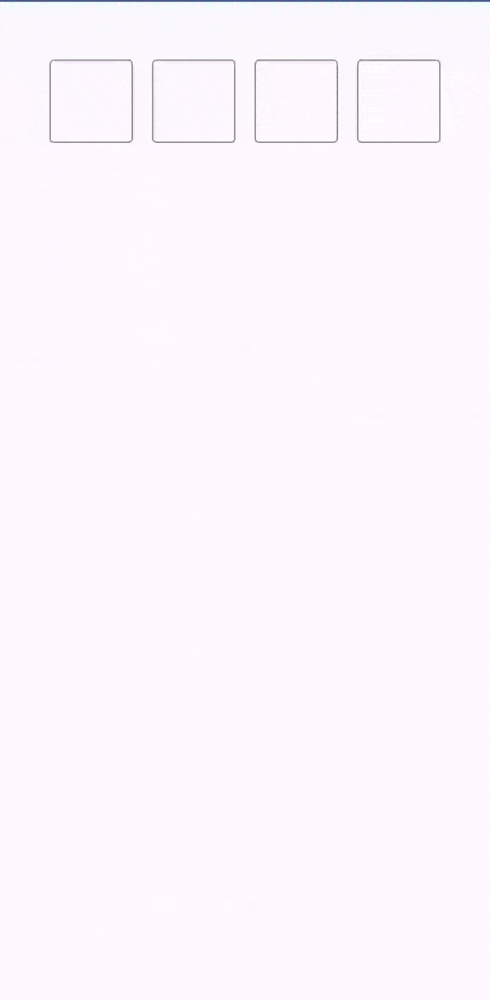
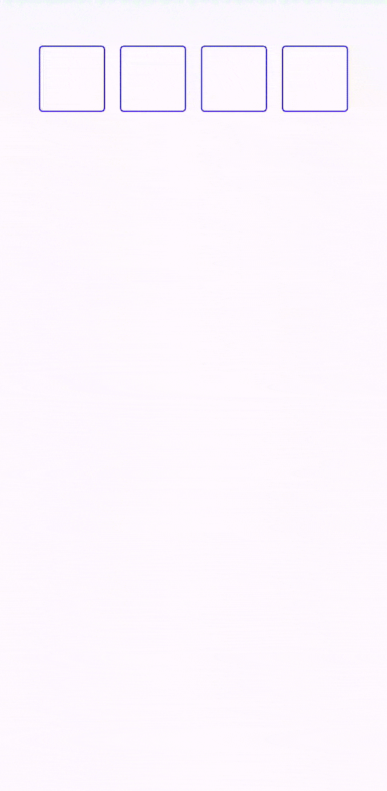
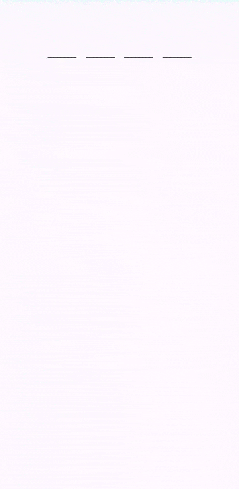
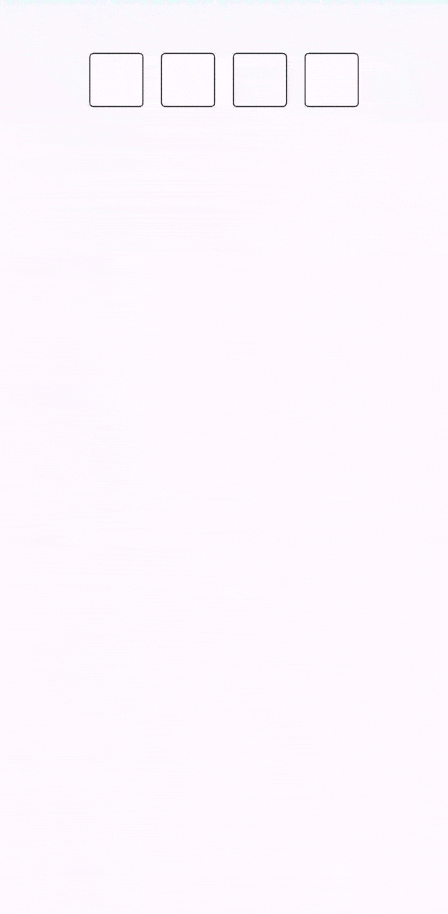
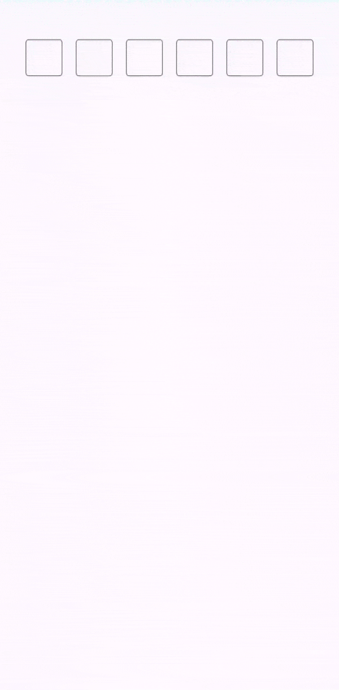

# ComposePinInput - A Jetpack Compose PIN Entry Library

Welcome to the `ComposePinInput` library for Android, built with Kotlin and Jetpack Compose using Material Design 3 principles. This customizable and versatile library allows you to easily integrate pin entry fields into your Compose UI, ideal for pin code, OTP, or password input.


The GIF below demonstrates the `ComposePinInput` in a live application scenario. Following the GIF, you will find the example code that shows how to implement this functionality using Jetpack Compose.




Using the `ComposePinInput` into your Jetpack Compose layout is straightforward. The example below demonstrates a basic setup. In this setup, we define a `Preview` composable function that maintains the state of the entered pin. The `ComposePinInput` composable takes the current `pin` value, a lambda to handle value changes, and an action to perform when the pin has been completely entered. It also allows you to customize the cell size and apply a predefined style, such as a box around each digit.

```kotlin
@Composable
fun Preview() {
    // State to hold the value of the pin
    var pin by remember { mutableStateOf("") }
    // Local context to show a toast message
    val context = LocalContext.current
  
    ComposePinInput(
        value = pin,
        onValueChange = {
            pin = it // Update the state when the value changes
        },
        cellSize = 70.dp, // size (height and width of each Cell
        onPinEntered = { // when the PIN has been entered get notified
            Toast.makeText(context, "$it", Toast.LENGTH_SHORT).show()
        },

        style = ComposePinInputStyle.BOX
    )
}
```

## Input Masking with Asterisks

Here is a version that masks the input, displaying asterisks (*) instead of the actual characters as the user types:




```kotlin
@Composable
fun Preview() {
    // State to hold the value of the pin
    var pin by remember { mutableStateOf("") }
    // Local context to show a toast message
    val context = LocalContext.current
  
    ComposePinInput(
        value = pin,
        mask= '*', // Masks the input with asterisks
        onValueChange = {
            pin = it
        },
        cellSize = 70.dp,
        onPinEntered = {
            Toast.makeText(context, "$it", Toast.LENGTH_SHORT).show()
        },

        style = ComposePinInputStyle.BOX
    )
}
```
## Custom Cell Border Colors
Enhance the visual appeal of your `ComposePinInput` by customizing the cell border colors, including the color change when a cell is focused:



```kotlin
@Composable
fun Preview() {
    var pin by remember { mutableStateOf("") }
    val context = LocalContext.current
  
    ComposePinInput(
        value = pin,
        mask= '*',
        cellBorderColor = Color.Blue, // Just pass the color here for the cell/box border
        focusedCellBorderColor = Color.Magenta, // when the box is focused it's color can be customized here
        onValueChange = {
            pin = it
        },
        cellSize = 70.dp,
        onPinEntered = {
            Toast.makeText(context, "$it", Toast.LENGTH_SHORT).show()
        },

        style = ComposePinInputStyle.BOX
    )
}
```

# Underline Style Customization
You can change the shape of `ComposePinInput` instead of Boxes simple underlines are also supported
For a subtler look, `ComposePinInput` supports an underline style instead of boxes. The following example demonstrates this style:





```kotlin
@Composable
fun Preview() {
    var pin by remember { mutableStateOf("") }
    val context = LocalContext.current

  // Underline style with custom border colors
    ComposePinInput(
        value = pin,
        mask= '*',
        cellBorderColor = Color.DarkGray, // Just pass the color here for the cell/box border
        focusedCellBorderColor = Color.Blue, // when the box is focused it's color can be customized here
        onValueChange = {
            pin = it
        },
        cellSize = 70.dp,
        onPinEntered = {
            Toast.makeText(context, "$it", Toast.LENGTH_SHORT).show()
        },

        style = ComposePinInputStyle.UNDERLINE // Apply the underline style
    )
}
```
# Dynamic Background and Font Colors
Customize the bfocu ackground color and font color



```kotlin
@Composable
fun Preview() {
    var pin by remember { mutableStateOf("") }
    val context = LocalContext.current

    // Box style with dynamic background and font colors
    ComposePinInput(
        value = pin,
        mask= '*',
        cellBorderColor = Color.DarkGray, // Just pass the color here for the cell/box border
        focusedCellBorderColor = Color.Blue, // when the box is focused it's color can be customized here
        cellColorOnSelect = Color.Cyan // This will change the color once focus is on the cell
        fontColor = Color.Blue, // This is how font color can be changed
        onValueChange = {
            pin = it
        },
        cellSize = 70.dp,
        onPinEntered = {
            Toast.makeText(context, "$it", Toast.LENGTH_SHORT).show()
        },

        style = ComposePinInputStyle.BOX // // Retaining the box style
    )
}
```

# Flexibility in Number of Cells and Mask Character
`ComposePinInput` is highly flexible, allowing you to define the number of cells and choose a custom mask character, as illustrated below:




```kotlin
@Composable
fun Preview() {
    var pin by remember { mutableStateOf("") }
    val context = LocalContext.current

  // Custom number of cells and mask character
    ComposePinInput(
        value = pin,
        mask = '⚫', // // Choose any character as the mask
        maxSize = 6, // // Define the number of cells, 4 are default if this property is not used
        cellSize = 45.dp, // default size is 50.dp, this property is optional
        onValueChange = {
            pin = it
        },
        onPinEntered = {
            Toast.makeText(context, "$it", Toast.LENGTH_SHORT).show()
        },

        style = ComposePinInputStyle.BOX // // Using the box style
    )
}
```


# How to Use

To use [Library Name], follow these steps:

## Installation

### Gradle Setup

1. **Add the JitPack repository to your build file, if not already added**

   Add the following in your root `build.gradle` at the end of repositories:

   ```gradle
   allprojects {
     repositories {
       ...
       maven { url 'https://jitpack.io' }
     }
   }
   ```
   **Or if you're using build.gradle.kts:**
   ```gradle
   allprojects {
      repositories {
    ...
        maven(url = "https://jitpack.io")
      }
    }
   ```
2. **Add the dependency**
   ```gradle
   dependencies {
      implementation 'com.github.sharp-edge:ComposePinInput:1.0.3'
    }
   ```
   **for build.gradle.kts:**
   ```gradle
   dependencies {
      implementation ("com.github.sharp-edge:ComposePinInput:1.0.3")
    }
   ```


## Known Issues

As of the current version, the library has the following known limitation:

- **Theme Support**: The `ComposePinInput` component does not currently support centralized theme management. This means it does not automatically adopt colors, fonts, and other styling properties from the app's theme.

  - *Impact*: All parameters for color, font size, and other styling must be explicitly passed to the component; it will not inherit these from the app's theme settings.
  - *Status*: This is a known design limitation in the current release. Future versions may include improved theme support.

We welcome contributions and suggestions on how to enhance theming capabilities. If you have ideas or solutions, please share them by opening an [issue](https://github.com/sharp-edge/ComposePinInput/issues) or submitting a pull request.

Please report any new issues you encounter, and I will aim to address them in subsequent releases.


## Bugs and Issues

If you encounter any bugs or issues with this library, please report them in the [Issues](https://github.com/sharp-edge/ComposePinInput/issues) section of the repository. Before creating a new issue, please check to see if a similar issue has already been reported by another user.

When reporting an issue, try to include as much information as possible about the environment where the bug occurred, steps to reproduce the issue, expected behavior, and any other information that might help us resolve the problem. Screenshots or code snippets can also be very helpful.


   
## License

This project is licensed under the Apache License 2.0 - see the [LICENSE](LICENSE) file for details.

   
